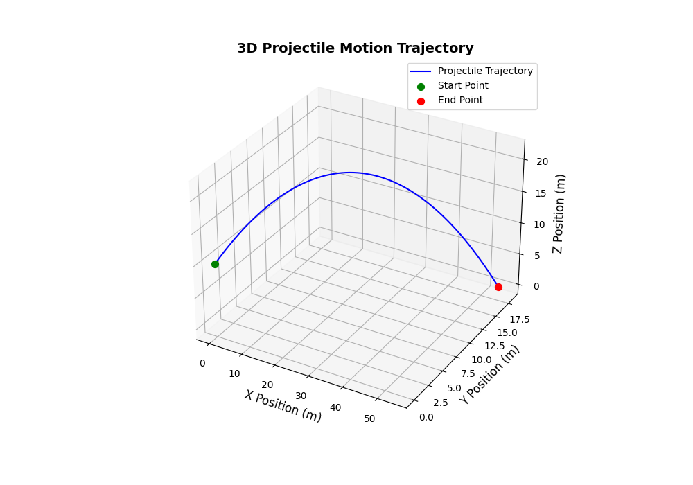
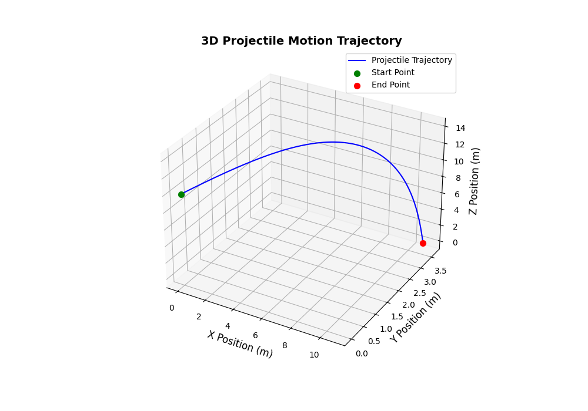
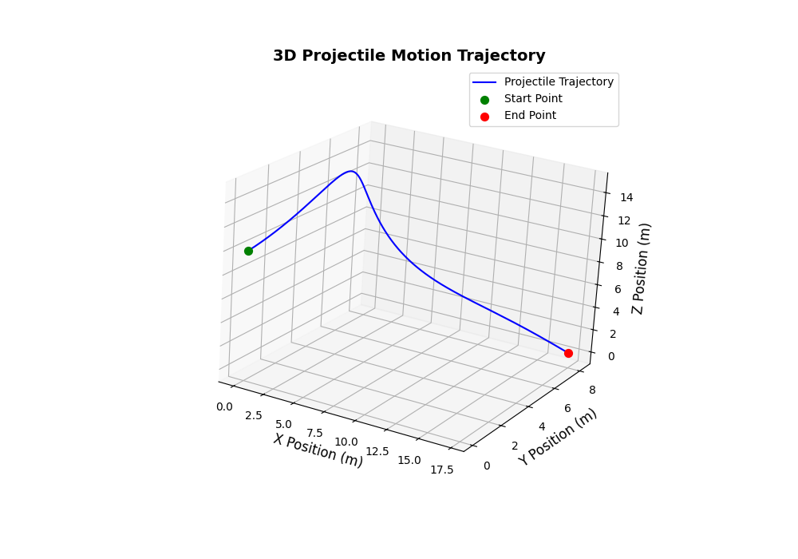
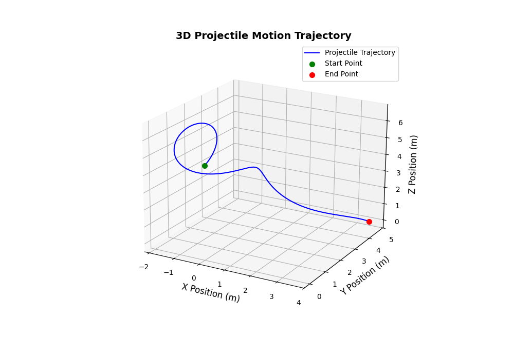

# Project 1: Realistic 3D Projectile Motion

**Author:** Nels Buhrley
**Language:** C++17 · Python 3 (visualization)
**Build:** `make` — see [Build & Run](#build--run)

---

## Overview

This project implements a **3D projectile motion simulator** that goes well beyond the introductory "no air resistance" approximation. The simulation integrates the full equations of motion including **aerodynamic drag**, **spin-induced Magnus force**, and **environmental wind**, producing physically realistic trajectories for projectiles ranging from baseballs to ping-pong balls. Integration is performed with a **4th-order Runge-Kutta** scheme, and results are exported to CSV for 3D visualization in Python.

---

## Physics Background

### Equations of Motion

A projectile of mass $m$ moving through air at velocity $\vec{v}$ experiences three forces simultaneously:

$$m\vec{a} = \vec{F}_\text{gravity} + \vec{F}_\text{drag} + \vec{F}_\text{Magnus}$$

#### Gravity

$$\vec{F}_\text{gravity} = -mg\hat{z}$$

where $g = 9.81$ m/s² is the gravitational acceleration.

#### Aerodynamic Drag

$$\vec{F}_\text{drag} = -\frac{1}{2}\rho \|\vec{v}_\text{rel}\|^2 C_d A \,\hat{v}_\text{rel}$$

where:
- $\rho$ is the air density (default 1.225 kg/m³)
- $\vec{v}_\text{rel} = \vec{v} - \vec{v}_\text{wind}$ is the velocity relative to the air
- $C_d$ is the drag coefficient (dimensionless)
- $A = \pi r^2$ is the cross-sectional area
- $\hat{v}_\text{rel}$ is the unit vector along the relative velocity

The drag force is proportional to $v^2$ and always opposes the relative motion, producing the characteristic asymmetric trajectory where the descending arc is steeper than the ascending arc.

#### Magnus Force (Spin Effect)

$$\vec{F}_\text{Magnus} = S\,(\vec{\omega} \times \vec{v})$$

where $S$ is the spin factor (units of m²/s) and $\vec{\omega}$ is the angular velocity vector of the projectile. This force arises because a spinning object creates asymmetric pressure distributions in the surrounding airflow — the effect that makes a curveball curve, a golf ball hook or slice, and a table-tennis ball dip.

The direction of the Magnus force is perpendicular to both the spin axis and the velocity, following the right-hand rule of the cross product. For a baseball with backspin ($\vec{\omega}$ horizontal), the Magnus force provides lift; for sidespin, it produces lateral deflection.

### Net Acceleration

Combining all forces and dividing by mass:

$$\vec{a} = -g\hat{z} - \frac{\rho \|\vec{v}_\text{rel}\|^2 C_d A}{2m}\hat{v}_\text{rel} + \frac{S}{m}(\vec{\omega} \times \vec{v})$$

This is implemented directly in `Projectile::calculateAcceleration()`.

---

## Code Structure

| File | Role |
|---|---|
| `main.cpp` | Entry point — constructs `Run`, which handles user interaction |
| `include/Projectile.h` | Declares `Vector3D`, `Vector4D`, `Projectile`, `Trajectory`, and preset subclasses |
| `include/Processing.h` | Declares `rk4Simulation()`, info helpers, and `Run` class |
| `src/Projectile.cpp` | Implements vector operations, `calculateAcceleration()`, CSV output |
| `src/Processing.cpp` | Implements RK4 integrator, `Run` controller with interactive menus |

### Preset Projectiles

The code includes physically accurate presets defined as subclasses of `Projectile`:

| Preset | Mass (kg) | Radius (m) | $C_d$ | Air Density (kg/m³) | Spin Factor $S/m$ | Notes |
|---|---|---|---|---|---|---|
| `Baseball` | 0.149 | 0.0366 | 0.35 | 1.225 | 4.1×10⁻⁴ | Realistic MLB parameters |
| `pingPongBall` | 0.0027 | 0.02 | 0.50 | 1.27 | 0.04 | High spin-to-mass ratio |
| `perfectProjectile` | 1.0 | 0.1 | 0.0 | 0.0 | 0.0 | No drag or spin (textbook parabola) |

### RK4 Integration

The 4th-order Runge-Kutta method advances the state vector $\vec{y} = (\vec{r}, \vec{v}, t)$ at each time step:

$$\vec{y}_{n+1} = \vec{y}_n + \frac{h}{6}\left(\vec{k}_1 + 2\vec{k}_2 + 2\vec{k}_3 + \vec{k}_4\right)$$

with the standard intermediate evaluations $\vec{k}_1 \ldots \vec{k}_4$. The local truncation error is $\mathcal{O}(h^5)$ and the global error is $\mathcal{O}(h^4)$, providing high accuracy even with moderate time steps.

The simulation terminates when the projectile hits the ground ($z \leq 0$ after launch), and the full trajectory is stored as a sequence of `Vector4D` points $(x, y, z, t)$.

---

## Results

<p align="center">
  
  
</p>

<p align="center">
  
  
</p>

*3D trajectory plots showing the effects of drag and Magnus force on projectile paths. Compare the symmetric parabola of the `perfectProjectile` (no drag) with the asymmetric arcs of the `Baseball` and `pingPongBall` (drag + spin).*

---

## Sources of Error

| Source | Nature | Mitigation |
|---|---|---|
| **Time step truncation** | RK4 global error is $\mathcal{O}(h^4)$; too-large $h$ produces inaccurate trajectories | Use small `dt` (default 0.001 s); validate against analytic parabola |
| **Constant drag coefficient** | Real $C_d$ varies with Reynolds number (speed) | Adequate for subsonic projectiles; supersonic would need $C_d(\text{Re})$ |
| **Fixed air density** | Real $\rho$ decreases with altitude ($\rho(h) = \rho_0 e^{-h/H}$) | Negligible for trajectories below ~1 km |
| **Rigid-body assumption** | Spin rate assumed constant throughout flight | Acceptable for short flights; longer trajectories need spin decay |
| **Ground model** | Flat ground at $z = 0$; no terrain | Sufficient for ballistics validation |

---

## Build & Run

### Prerequisites

- **C++17** compatible compiler (`clang++` or `g++`)
- **Python 3** with `pandas` and `matplotlib`

### Build

```bash
make
```

### Run

```bash
./bin/main
```

The program presents an interactive menu to choose between validation runs, preset projectiles, or custom parameters. Output is written to `Output/trajectoryN.csv` (auto-incrementing filenames).

### Visualize

```bash
python3 ploting.py
```

Produces a 3D trajectory plot saved to `Output/trajectoryN.png`.

---

## Simulation Parameters

Configured interactively at runtime or via preset classes:

| Parameter | Description | Units |
|---|---|---|
| Initial position | Launch point $(x_0, y_0, z_0)$ | m |
| Initial velocity | Launch velocity $(v_x, v_y, v_z)$ | m/s |
| Spin vector | Angular velocity $(\omega_x, \omega_y, \omega_z)$ | rad/s |
| Mass | Projectile mass | kg |
| Radius | Projectile radius (for drag area $A = \pi r^2$) | m |
| Drag coefficient | Dimensionless $C_d$ | — |
| Air density | Atmospheric density $\rho$ | kg/m³ |
| Spin factor | Magnus coefficient $S/m$ | m²/s |
| Wind | Environmental wind velocity vector | m/s |

---

## Key Techniques

| Technique | Purpose |
|---|---|
| 4th-order Runge-Kutta integration | $\mathcal{O}(h^4)$ accurate trajectory computation |
| `Vector3D` / `Vector4D` operator overloading | Clean, readable vector arithmetic |
| Inheritance-based projectile presets | `Baseball`, `pingPongBall`, etc. encode real physical parameters |
| Cross-product Magnus force | Physically correct spin-dependent lateral deflection |
| Quadratic drag law | Realistic air resistance proportional to $v^2$ |
| Auto-incrementing file output | Multiple simulation runs saved without overwriting |
| Python 3D visualization | Immediate visual validation of trajectories |

---

## Project Structure

```
Project 1: realistic projectile motion/
├── main.cpp              # Entry point — interactive simulation launcher
├── include/
│   ├── Projectile.h      # Vector3D, Vector4D, Projectile, preset subclasses
│   └── Processing.h      # RK4 integrator, Run controller
├── src/
│   ├── Projectile.cpp    # Physics: acceleration, vector ops, CSV output
│   └── Processing.cpp    # Integration loop, interactive menu, file I/O
├── ploting.py            # Python 3D trajectory visualization
├── bin/                  # Compiled executables
└── Output/               # CSV data and PNG trajectory plots
    ├── trajectory1.csv
    └── trajectory1.png
```

---

*Nels Buhrley — Computational Physics, 2025*
