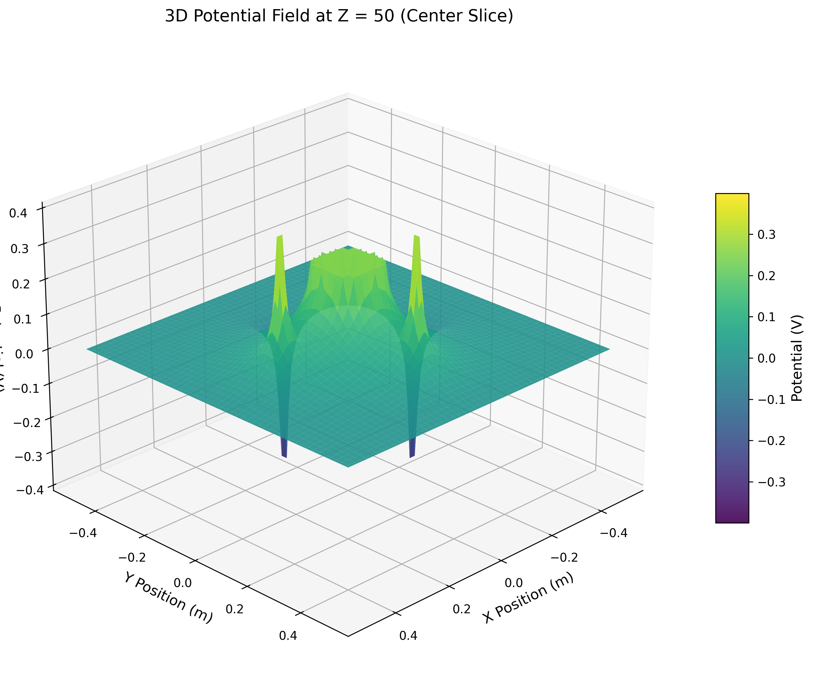

# Project 4: Overrelaxation — 3D Electrostatic Potential Solver

**Author:** Nels Buhrley
**Language:** C++17 with OpenMP · Python 3 (visualization)
**HPC:** Run on the BYU Supercomputer
**Build:** `make release` — see [Build & Run](#build--run)

---

## Overview

This project solves **Laplace's equation** $\nabla^2 V = 0$ on a three-dimensional grid using **Red-Black Successive Over-Relaxation (SOR)** — an iterative relaxation method that converges significantly faster than standard Gauss-Seidel iteration. The solver handles arbitrary **Dirichlet boundary conditions** including conducting surfaces held at fixed potentials and point charges embedded in the domain. The entire SOR kernel is parallelized with **OpenMP**, achieving efficient multi-core scaling on grids up to $1000^3$ ($10^9$) unknowns.

---

## Physics Background

### Laplace's Equation

In a charge-free region of space, the electrostatic potential $V(\vec{r})$ satisfies **Laplace's equation**:

$$\nabla^2 V = \frac{\partial^2 V}{\partial x^2} + \frac{\partial^2 V}{\partial y^2} + \frac{\partial^2 V}{\partial z^2} = 0$$

This is one of the fundamental PDEs in physics, governing not only electrostatics but also steady-state heat conduction, incompressible fluid flow, and gravitational fields in vacuum. Given boundary conditions (voltages on conducting surfaces, charge distributions), the solution $V(\vec{r})$ is unique (Dirichlet's theorem).

### Finite Difference Discretization

The continuous domain is replaced by a uniform cubic grid of $N^3$ points with spacing $\Delta x = L/N$. The Laplacian is approximated by the second-order central difference stencil:

$$\nabla^2 V \approx \frac{V_{i+1,j,k} + V_{i-1,j,k} + V_{i,j+1,k} + V_{i,j-1,k} + V_{i,j,k+1} + V_{i,j,k-1} - 6V_{i,j,k}}{\Delta x^2} = 0$$

Solving for $V_{i,j,k}$:

$$V_{i,j,k}^\text{relax} = \frac{1}{6}\left(V_{i+1,j,k} + V_{i-1,j,k} + V_{i,j+1,k} + V_{i,j-1,k} + V_{i,j,k+1} + V_{i,j,k-1}\right)$$

Each interior point relaxes toward the average of its six nearest neighbors.

### Successive Over-Relaxation (SOR)

Plain Gauss-Seidel iteration ($V_{i,j,k} \leftarrow V^\text{relax}$) converges slowly — $\mathcal{O}(N^2)$ iterations for an $N$-point grid. **Over-relaxation** accelerates convergence by overshooting toward the relaxed value:

$$V_{i,j,k}^{(n+1)} = (1 - \omega)\,V_{i,j,k}^{(n)} + \omega\,V_{i,j,k}^\text{relax}$$

where the **relaxation parameter** $\omega \in (1, 2)$ controls the overshoot. The optimal value for a cubic grid is:

$$\omega_\text{opt} = \frac{2}{1 + \sin(\pi/N)}$$

which reduces the iteration count from $\mathcal{O}(N^2)$ to $\mathcal{O}(N)$ — a dramatic speedup for large grids. This optimal $\omega$ is computed automatically in the constructor.

### Red-Black Ordering

Standard SOR has a sequential dependency: updating point $(i,j,k)$ reads neighbors that may have already been updated in the same sweep. **Red-black (checkerboard) ordering** eliminates this dependency by partitioning the grid into two disjoint sets:

- **Red points:** $(i + j + k)$ even
- **Black points:** $(i + j + k)$ odd

All red points depend only on black neighbors and vice versa. Within each color, all updates are **independent** and can be executed in any order — or in parallel. A full iteration consists of one red sweep followed by one black sweep.

### Test Configuration

The default boundary conditions configure:
- A **conducting disk** of ~10 cm radius centered in the domain, held at $V = 0.25$ V
- **Point charges** of $\pm 1\;\mu\text{C}$ at positions offset by 25 cm along the $x$ and $y$ axes from center

The point-charge voltage is computed from Coulomb's law:

$$V = \frac{q}{4\pi\varepsilon_0 r}$$

and applied as a Dirichlet constraint over a small sphere ($r = 1$ cm) surrounding each charge location.

---

## Algorithm & Parallelism

### OpenMP Parallelization

The SOR kernel is the computational bottleneck, performing $\mathcal{O}(N^3)$ floating-point operations per iteration across up to $8N$ iterations. Four regions are parallelized:

| Region | Directive | Scheduling | Purpose |
|---|---|---|---|
| `redOrBlackUpdate()` | `#pragma omp parallel for collapse(2) schedule(static)` | Static | Core SOR kernel — updates all points of one color in parallel |
| `computeResidual()` | `#pragma omp parallel for reduction(+:residual_squared) collapse(3) schedule(static)` | Static + reduction | $L^2$ residual norm with thread-safe accumulation |
| Grid initialization | `#pragma omp parallel for collapse(3) schedule(static)` | Static | Zero-fill $u$ and $f$ arrays |
| CSV output | `#pragma omp parallel for schedule(static)` | Static | Parallel string formatting partitioned by thread |

The `collapse(2)` on the SOR kernel merges the outer two loops ($i$ and $j$) into a single parallel iteration space, exposing $\mathcal{O}(N^2)$ independent chunks to OpenMP. The inner $k$-loop is sequential within each chunk but strides by 2 to visit only the target color, maintaining the red-black invariant.

### Convergence Monitoring

The $L^2$ residual norm is computed every 100 iterations:

$$R = \sqrt{\sum_{i,j,k} \left(\nabla^2_h V_{i,j,k}\right)^2}$$

where $\nabla^2_h$ is the discrete Laplacian. The simulation converges when $R < \varepsilon$ (default $\varepsilon = 4 \times 10^{-10}$) or after $8N$ maximum iterations.

---

## Results

<p align="center">
  
  
</p>

<p align="center">
  
  
</p>

*2D slices through the 3D electrostatic potential field at different $z$-planes. The conducting disk (center) and dipole point charges (offset) create the characteristic equipotential structure. Color maps the potential magnitude.*

---

## Sources of Error

| Source | Nature | Mitigation |
|---|---|---|
| **Spatial discretization** | Second-order central differences: error $\mathcal{O}(\Delta x^2)$ | Increase $N$; error quarters when grid doubles |
| **Convergence tolerance** | Residual $R > 0$ means the solution is approximate | Tighten `tolerance`; default $4 \times 10^{-10}$ is stringent |
| **Point-charge singularity** | $V \to \infty$ at exact charge location; discretized over a small sphere | Sphere radius = 1 cm; finer grids resolve the near-field better |
| **Boundary effects** | Domain walls at $V = 0$ (grounded); close walls distort the field | Use large domain relative to charge separation; $N = 1000$ with 1 m cube gives 1 mm resolution |
| **Floating-point accumulation** | $10^9$ additions per iteration; round-off accumulates | `double` precision; residual monitored explicitly |

**Computational complexity:**
- Per iteration: $\mathcal{O}(N^3)$
- Total: $\mathcal{O}(N^4)$ with optimal $\omega$ (vs. $\mathcal{O}(N^5)$ for Gauss-Seidel)
- Default parameters ($N = 1000$): ~5 minutes wall time on an 8-thread machine

---

## Build & Run

### Prerequisites

- **C++17** compatible compiler (`clang++` or `g++`)
- **OpenMP** (`brew install libomp` on macOS)
- **zlib** (for `.npz` output via `cnpy`)
- **Python 3** with `numpy` and `matplotlib` (for visualization)

### Build

```bash
make release    # Optimized build (-O3, march=native, OpenMP)
make debug      # Debug build (no optimization)
make clean      # Remove build artifacts
```

### Run

```bash
./bin/main
```

Output is saved to `output.csv` and `output.npz`.

### Output Format

| File | Contents |
|---|---|
| `output.csv` | Hierarchical text: nested by $z$, $y$, $x$ layers with potential values |
| `output.npz` | NumPy array `potential` of shape $(N, N, N)$ — load with `np.load("output.npz")["potential"]` |

---

## Simulation Parameters

Configured in [main.cpp](main.cpp):

| Parameter | Default | Description |
|---|---|---|
| `N` | 1000 | Cubic grid edge length ($N^3$ unknowns) |
| `physicalDimensions` | 1.0 m | Physical size of the simulation cube |
| `tolerance` | 4×10⁻¹⁰ | Convergence threshold on $L^2$ residual |
| $\omega$ | auto | Optimal SOR parameter $2/(1 + \sin(\pi/N))$ |
| Max iterations | $8N$ | Safety limit |

---

## Key Techniques

| Technique | Purpose |
|---|---|
| Red-Black Successive Over-Relaxation | $\mathcal{O}(N)$ convergence vs. $\mathcal{O}(N^2)$ for Gauss-Seidel |
| Optimal $\omega = 2/(1 + \sin(\pi/N))$ | Minimizes iteration count analytically |
| Red-black checkerboard decomposition | Eliminates update dependencies; enables safe parallelism |
| `collapse(2)` OpenMP kernel | Exposes $N^2$ independent work units to thread pool |
| `reduction(+:residual_squared)` | Thread-safe residual accumulation without locks |
| Dirichlet boundary via source array `f[]` | Boundary points held fixed; interior points relaxed freely |
| Point-charge voltage from Coulomb's law | Physically correct embedded charge boundary conditions |
| NPZ output via `cnpy` | Compressed, self-describing format for direct NumPy loading |

---

## Project Structure

```
Project 4: Overrelaxation/
├── main.cpp        # Entry point: configures grid, charges, runs SOR
├── Processing.h    # PotentialField class: SOR kernel, residual, I/O
├── Makefile        # Build targets: release, debug, profile-guided
├── bin/            # Compiled executable
├── output.csv      # Full 3D potential (hierarchical text)
├── output.npz      # Full 3D potential (NumPy compressed)
└── output/         # Visualization outputs (PNG slices)
```

---

*Nels Buhrley — Computational Physics, 2025*
