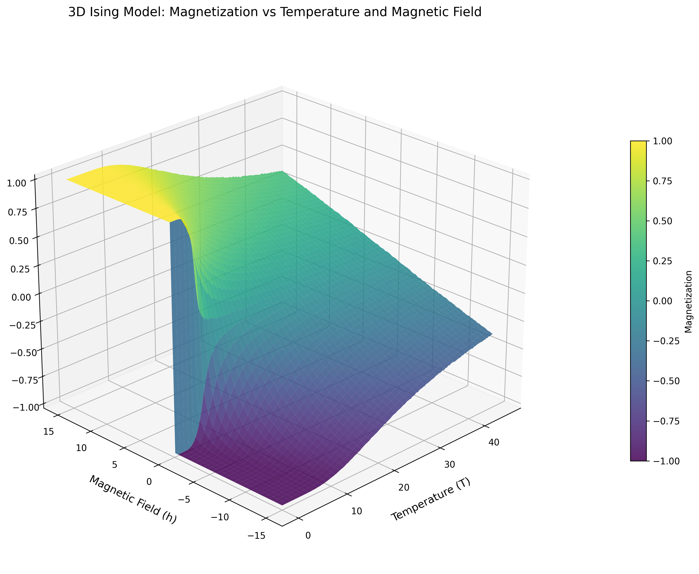
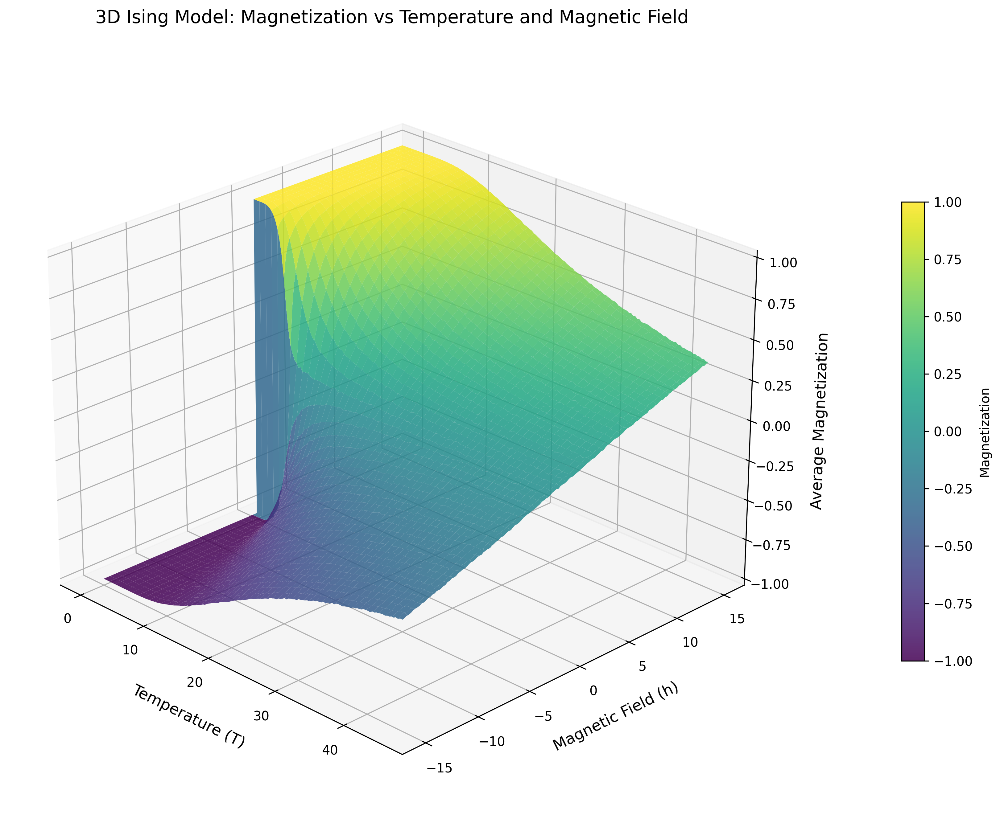
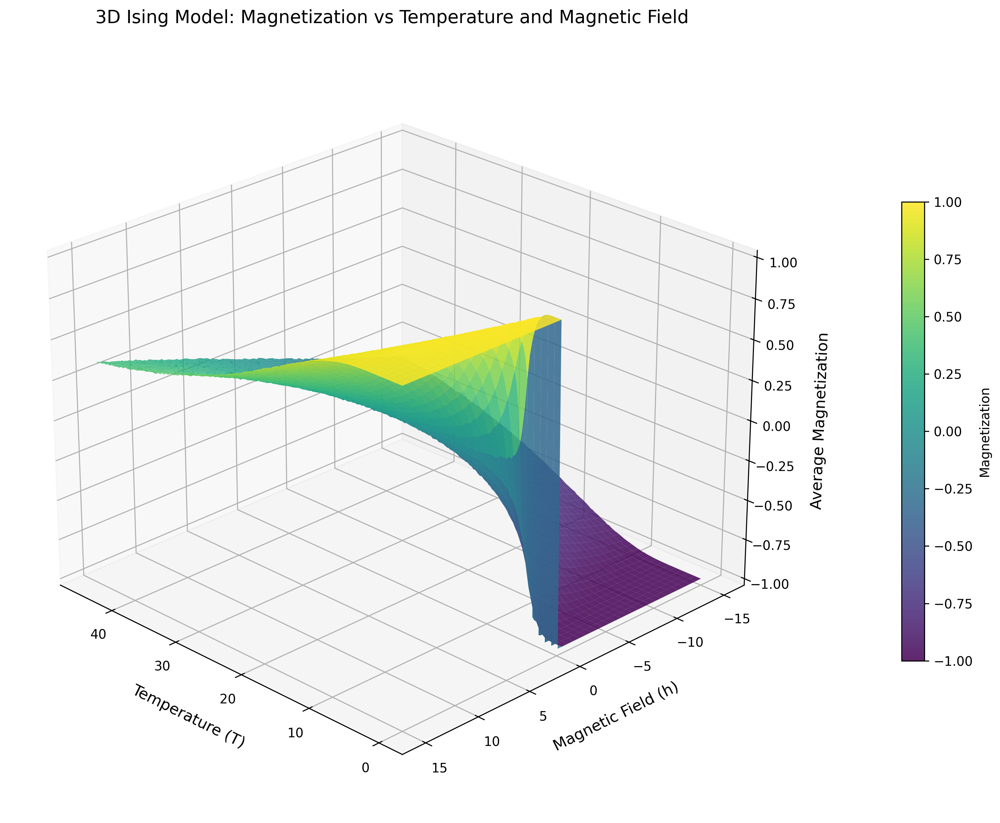
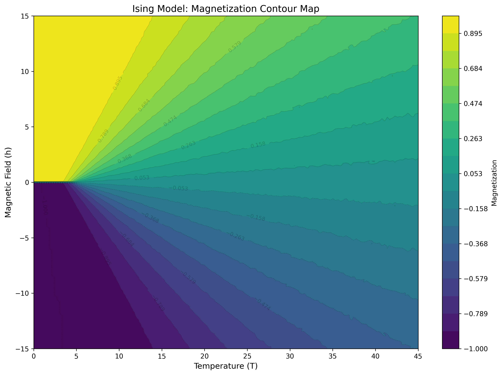

<p align="center">
  <a href="https://nelsbuhrley.github.io/CPP-Numerical-Modeling/#academic-projects"><strong>← Back to Portfolio Hub</strong></a>
</p>

# Project 7: The 3D Ising Model

**Author:** Nels Buhrley
**Language:** C++17 with OpenMP · Python 3 (visualization)
**HPC:** Run on the BYU Supercomputer (128 CPUs via SLURM)
**Build:** `make release` — see [Build & Run](#build--run)

---

## Table of Contents

- [Overview](#overview)
- [Physics Background](#physics-background)
  - [The Ising Hamiltonian](#the-ising-hamiltonian)
  - [Phase Transition](#phase-transition)
  - [Observable: Average Magnetization](#observable-average-magnetization)
- [Code Structure](#code-structure)
  - [`Material` Class](#material-class)
  - [`Simulation` Class](#simulation-class)
- [Results](#results)
- [Sources of Error](#sources-of-error)
- [Build & Run](#build--run)
- [Simulation Parameters](#simulation-parameters)
- [Key Techniques](#key-techniques)
- [Project Structure](#project-structure)

---

## Overview

This project implements a full **Monte Carlo simulation of the three-dimensional Ising model** on a cubic lattice. The simulation sweeps across a two-dimensional parameter space of temperature $T$ and external magnetic field $h$, producing a surface of average magnetization $\langle m \rangle(T, h)$ that captures the system's full thermodynamic behavior — including the **ferromagnetic phase transition** and the **onset of spontaneous symmetry breaking**.

The implementation combines the **Metropolis–Hastings algorithm**, a **checkerboard (black-red) lattice decomposition**, **precomputed energy lookup tables**, and **OpenMP multi-threaded parallelism** to efficiently map the parameter space.

---

## Physics Background

### The Ising Hamiltonian

The Ising model places discrete binary spins $\sigma_i \in \{-1, +1\}$ on the sites of a 3D cubic lattice of $N \times N \times N$ sites, with total energy:

$$\mathcal{H} = -J \sum_{\langle i,j \rangle} \sigma_i \sigma_j - h \sum_i \sigma_i$$

where $J > 0$ is the ferromagnetic exchange coupling (set to 1 in natural units), the first sum runs over nearest-neighbor pairs (6 per site in 3D), and $h$ is the external magnetic field.

### Phase Transition

At low temperature and zero field the system exhibits **spontaneous magnetization**. As temperature rises, entropy dominates and magnetization collapses continuously to zero at the **Curie point** $T_c$. The 3D Ising model has:

$$T_c \approx 4.51 \; J/k_B$$

in units where $J = k_B = 1$.

### Observable: Average Magnetization

The primary output at each $(T, h)$ point is the **average magnetization per spin**:

$$\langle m \rangle = \frac{1}{N^3} \sum_i \sigma_i$$

---

## Code Structure

All simulation logic lives in two files:

| File | Role |
|---|---|
| `main.cpp` | Sets parameters, constructs `Simulation`, calls `runIsingSimulation()` |
| `processing.h` | `Material` class (Metropolis engine), `Simulation` class (sweep, analysis, I/O) |

### `Material` Class

Each `Material` instance represents one independent lattice at a fixed $(T, h)$ pair.

#### Construction

```cpp
Material(int n, float temperature, float magnetization, int numIterations, uint32_t seed)
```

The physical lattice is $N \times N \times N$ but the internal allocation is $(N+2)^3$ to hold **ghost boundary layers**. The constructor calls three setup methods in order:

1. `establishRNG()` — seeds a per-object `std::mt19937` from `seed`, giving each parallel worker its own independent random stream
2. `initializeSpinsRandomly()` — fills the inner lattice with random $\pm 1$ values; an overload `initializeSpinsUniformly(int8_t)` sets all spins to a single value instead
3. `precalculateEnergyTables()` — builds `deltaE_table[2][7]` and `exp_table[2][7]` (see [Precomputed Tables](#precomputed-energy-lookup-tables))

Spins are stored as `int8_t` in a flat 1D `std::vector<int8_t>` using row-major indexing:

$$\text{index}(x, y, z) = x \cdot N^2 + y \cdot N + z$$

Using `int8_t` rather than `int` keeps the $100^3$ lattice $4\times$ smaller and cache-friendly for the sequential $z$-loop. `getSpin()` and `setSpin()` are inlined accessors over this flat array.

---

#### Precomputed Energy Lookup Tables

`flipSpin()` is the innermost function, called $O(N^3 \times \text{iterations})$ times. In a 3D model with 6 neighbors, the neighbor sum $S \in \{-6,-4,-2,0,+2,+4,+6\}$ admits only **7 values**. Combined with the 2 spin states, only **14 distinct $\Delta E$ values** ever arise:

$$\Delta E = 2\sigma_i(S + h)$$

`precalculateEnergyTables()` computes both $\Delta E$ and $e^{-\Delta E/T}$ for all 14 combinations once, before any sweep:

```cpp
float deltaE_table[2][7];
float exp_table[2][7];
```

The inner loop then performs a plain array dereference instead of calling `exp()`.

---

#### `flipSpin(x, y, z)` — Metropolis Step

For site $(x,y,z)$, the neighbor sum is computed and mapped to a table index:

```cpp
void flipSpin(int x, int y, int z) {
    uint8_t neighborstate = (sum of 6 neighbors) / 2 + 3;  // maps [-6,6] → [0,6]
    uint8_t spinState = (getSpin(x, y, z) + 1) / 2;        // maps {-1,+1} → {0,1}
    if (deltaE_table[spinState][neighborstate] <= 0 ||
        distribution(gen) < exp_table[spinState][neighborstate]) {
        setSpin(x, y, z, -getSpin(x, y, z));
        currentTotalMagnetization += 2 * getSpin(x, y, z);  // incremental update
    }
}
```

The Metropolis acceptance rule is satisfied: always flip if $\Delta E \leq 0$, otherwise flip with probability $e^{-\Delta E/T}$. When a flip occurs, `currentTotalMagnetization` is updated by $\pm 2$ rather than recomputed — avoiding an $O(N^3)$ sum every step.

---

#### `iteration()` — One Full Lattice Sweep

Each call performs three stages.

**Stage 1 — Ghost layer refresh** (periodic boundary conditions):

Rather than wrapping indices on every neighbor access, the $(N+2)^3$ lattice carries one ghost cell on each face. Before each sweep all six faces are refreshed by copying the opposite interior face:

```cpp
// Z faces
for (x) for (y) {
    setSpin(x, y, 0,   getSpin(x, y, n-2));   // bottom ghost ← top interior
    setSpin(x, y, n-1, getSpin(x, y, 1));     // top ghost ← bottom interior
}
// Y and X faces updated the same way
```

This is $O(N^2)$ per sweep, negligible against the $O(N^3)$ spin work, and keeps the inner loop branch-free.

**Stage 2 — Black pass** (sites where $(x+y+z)$ is even):

```cpp
for (x = 1; x < n-1; x++)
    for (y = 1; y < n-1; y++)
        for (z = (x+y)%2 + 1; z < n-1; z += 2)
            flipSpin(x, y, z);
```

**Stage 3 — Red pass** (sites where $(x+y+z)$ is odd):

```cpp
for (x = 1; x < n-1; x++)
    for (y = 1; y < n-1; y++)
        for (z = (x+y+1)%2 + 1; z < n-1; z += 2)
            flipSpin(x, y, z);
```

The parity offset `(x+y)%2` selects the correct starting $z$ so every visited site satisfies the desired color. Striding by 2 ensures no two sites in the same pass share a neighbor, making all updates within a pass **conflict-free**. A black pass followed by a red pass constitutes one full Monte Carlo sweep.

---

#### `runSimulation()` and `MagneticSusceptibility()`

`runSimulation()` runs in two phases:

**Phase 1 — Burn-in (5 * n sweeps):**
```cpp
for (int i = 0; i < 5 * n; i++) iteration();
```
These sweeps allow the system to reach thermal equilibrium from its initial state without contributing to any observable. The initial spin state (random or uniform) is forgotten here.

**Phase 2 — Measurement (`numIterations` sweeps):**
```cpp
for (int i = 0; i < numIterations; i++) {
    iteration();
    float m = (float)currentTotalMagnetization / N;
    sum_magnetization        += m;
    sum_magnetization_squared += m * m;
    sum_abs_magnetization    += std::abs(m);
}
averageAbsMagnetization     = sum_abs_magnetization     / numIterations;
averagemagnetization        = sum_magnetization          / numIterations;
averageMagnetizationSquared = sum_magnetization_squared  / numIterations;
```

After each sweep, the instantaneous magnetization per spin $m = M_\text{total}/N^3$ is read from `currentTotalMagnetization` (maintained incrementally by `flipSpin`) — no full-lattice sum is needed. Three accumulators are kept to compute $\langle m \rangle$, $\langle \vert m \vert \rangle$, and $\langle m^2 \rangle$.

`MagneticSusceptibility()` is called after the simulation completes and derives $\chi$ from the variance of $\vert  m\vert $:

$$\chi = \frac{N^3}{T}\left(\langle m^2 \rangle - \langle \\vert m\\vert  \rangle^2\right)$$

Using $\langle \vert m\vert  \rangle$ rather than $\langle m \rangle^2$ avoids cancellation errors in symmetry-broken phases where positive and negative magnetization states are sampled equally, which would drive $\langle m \rangle \to 0$ even deep in the ferromagnetic phase.

---

### `Simulation` Class

The `Simulation` class owns the full parameter sweep, analysis, and output. `main.cpp` constructs one instance and calls `runIsingSimulation()`, which chains three methods:

```
Simulation::runIsingSimulation()
    ├── runSimulation()                       — parallel Metropolis sweep
    ├── findCriticalTemperatureAndCalculateBeta()  — post-process
    └── saveResults()                         — NPZ + CSV output
```

#### `Simulation::runSimulation()` — Parallel Sweep

```
1. Generate a unique seed for every (h, T) pair from a master RNG
2. #pragma omp parallel for collapse(2) schedule(dynamic)
      for each (T[i], h[j]):
          Material material(n, T[i], h[j], iterations, +1, seed[j][i])
          material.runSimulation()
          avg_magnetizations[j][i]       = material.averageMagnetization
          magnetic_susceptibilities[j][i] = material.magneticSusceptibility
```

Each `Material` is initialized with all spins uniformly $+1$ (via the second constructor overload), which biases the system into the ferromagnetic minimum and reduces equilibration time. Seeds are drawn from a 2D array populated by a single-threaded master RNG before the parallel region, eliminating data races on the generator state.

#### `findCriticalTemperatureAndCalculateBeta()` — Critical Analysis

This runs in a second OpenMP parallel loop over field rows `j`:

**Step 1 — Find $T_c$:**
The critical temperature for each $h$ value is identified as the temperature where $\chi(T)$ is maximum:
```cpp
for (i in 0..numTempSteps)
    if (magnetic_susceptibilities[j][i] > maxSusceptibility)
        criticalTempIndex = i;
critical_temperatures[j] = temperatures[criticalTempIndex];
```
This works because $\chi$ diverges (and in a finite system peaks sharply) at $T_c$.

**Step 2 — Fit $\beta$:**
Near $T_c$ the order parameter scales as $\langle \vert m\vert  \rangle \sim (T_c - T)^\beta$. Taking logs gives:
$$\ln \langle \vert m\vert  \rangle = \beta \ln(T_c - T) + \text{const}$$
The code selects up to 40 points just below $T_c$ (filtering out points where $\vert m\vert  < 0.01$ or $T \geq T_c$ to avoid log-of-zero issues) and fits the slope via ordinary least squares in log-log space:
```cpp
slope = (n·ΣlogM·logT - ΣlogM·ΣlogT) / (n·ΣlogT² - (ΣlogT)²)
beta_exponents[j] = slope;
```
The extracted $\beta$ is saved alongside $T_c$ for each field row.

---

## Results

### Magnetization Surface

<div style="width: 100%; aspect-ratio: 16 / 9; max-height: 80vh; overflow: hidden; border: 1px solid #ddd; border-radius: 8px;">
    <iframe
        src="https://nelsbuhrley.github.io/CPP-Numerical-Modeling/assets/html-assets/magnetization_3d_interactive.html"
        width="100%"
        height="100%"
        style="border: none; display: block;">
    </iframe>
</div>

<a href="https://nelsbuhrley.github.io/CPP-Numerical-Modeling/assets/html-assets/magnetization_3d_interactive.html" target="_blank">View Simulation Fullscreen ↗️</a>

<p align="center">
  
</p>

*3D surface plot of the average magnetization $\langle m \rangle(T, h)$. The sharp cliff at $T_c \approx 4.51\,J/k_B$ (at $h = 0$) marks the ferromagnetic phase transition — the system transitions from ordered (magnetized) to disordered (paramagnetic) as temperature rises.*

<p align="center">
  
  
</p>

*Alternative viewing angles of the magnetization surface, showing the symmetry-breaking structure: for $h > 0$ the system prefers $+m$, for $h < 0$ it prefers $-m$, and the transition sharpens as $h \to 0$.*

### Magnetization Contour Map

<p align="center">
  
</p>

*Contour plot of $\langle m \rangle$ in the $(T, h)$ plane. The critical temperature is visible as the boundary between the ordered (yellow/purple) and disordered (color gradiant) phases.*

### Magnetization vs. Temperature

<p align="center">
  
  
  
</p>

*Magnetization as a function of temperature at three field strengths. At weak field ($h = 0.1$), the transition is sharp. Increasing $h$ smooths the transition and shifts the effective crossover temperature — at strong field ($h = 10$), magnetization persists well above $T_c$.*

---

## Sources of Error

| Source | Nature | Mitigation |
|---|---|---|
| Statistical fluctuations | MC results are stochastic | Increase `iterations`; ensemble-average over seeds |
| Finite-size effects | Finite $N$ smears the transition; $T_c(N) \neq T_c(\infty)$ | Increase $N$; apply finite-size scaling |
| Equilibration error | Early sweeps retain memory of the initial state | 100-sweep burn-in is hardcoded in `runSimulation()`; increase for larger $N$ |
| Parameter discretization | $T$ and $h$ sampled on finite grids | Increase `tempSteps`/`numHSteps` near $T_c$ |

**Computational complexity** (per $(T,h)$ point): $\mathcal{O}(N^3 \times \text{iterations})$

**Total**: $\mathcal{O}(N^3 \times \text{iterations} \times N_T \times N_h)$ — roughly $8 \times 10^{10}$ spin-update operations at default parameters.

---

## Build & Run

### Prerequisites

- **C++17** compiler (`g++` or `clang++`)
- **OpenMP** (`brew install libomp` on macOS)
- **zlib** (for `.npz` output)
- **Python 3** with `numpy` and `matplotlib`

### Build Targets

```bash
make release   # Optimized build (-O3, LTO, vectorization, march=native)
make unsafe    # Adds -ffast-math (may introduce minor FP drift)
make debug     # -O0, full warnings, OpenMP disabled
make profile-gen && ./bin/main && make profile-use  # Profile-guided optimization
```

### Run

```bash
./bin/main
```

Output is saved to `output/ising_results.npz` and `output/ising_results.csv`:

| Array | Shape | Description |
|---|---|---|
| `avg_magnetization` | `(N_h, N_T)` | $\langle m \rangle$ at each $(h, T)$ |
| `magnetic_susceptibility` | `(N_h, N_T)` | $\chi$ at each $(h, T)$ |
| `temperatures` | `(N_T,)` | Temperature grid |
| `magnetic_fields` | `(N_h,)` | Magnetic field grid |
| `critical_temperatures` | `(N_h,)` | $T_c(h)$ — peak susceptibility per field row |
| `beta_exponents` | `(N_h,)` | Fitted $\beta$ exponent per field row |

### Visualize

```bash
python3 plotting.py
```

Produces 3D surface plots and a 2D contour map in `output/`.

---

## Simulation Parameters

Configured in [main.cpp](main.cpp):

| Parameter | Default | Description |
|---|---|---|
| `N` | 100 | Cubic lattice edge length ($N^3$ spins) |
| `iterations` | 200 | MC sweeps per $(T, h)$ point |
| `minTemp` / `maxTemp` | 0 – 45 | Temperature range ($J/k_B$) |
| `tempSteps` | 200 | Temperature grid points |
| `hMin` / `hMax` | −15 – +15 | External field range |
| `numHSteps` | 200 | Field grid points |

---

## Key Techniques

| Technique | Purpose |
|---|---|
| Metropolis–Hastings MCMC | Correct Boltzmann sampling |
| Precomputed $\Delta E$ and $e^{-\Delta E/T}$ tables | Eliminates `exp()` from the inner loop |
| Checkerboard (black-red) decomposition | Race-free simultaneous updates within a sweep |
| Ghost boundary layers | Branch-free periodic boundary enforcement |
| `int8_t` + flat 1D array | $4\times$ smaller than `int`; cache-friendly $z$-loop |
| Incremental magnetization tracking | $O(1)$ magnetization update per flip instead of $O(N^3)$ |
| 100-sweep burn-in | Discards initial transient before measuring observables |
| Running accumulators for $\langle m \rangle$, $\langle \vert m\vert  \rangle$, $\langle m^2 \rangle$ | Enables susceptibility and critical-exponent analysis |
| Peak susceptibility $\to T_c$ | Locates the critical temperature per field row |
| Log-log OLS regression $\to \beta$ | Extracts the critical exponent from magnetization scaling below $T_c$ |
| `collapse(2)` + `dynamic` scheduling | Scalable multi-core parallelism across $(T, h)$ |
| Per-thread Mersenne Twister | Statistically independent, uncorrelated random streams |
| Profile-guided optimization (PGO) | Compiler uses runtime data for branch prediction and inlining |

---
## Project Structure

```
Project 7: The Ising Model/
├── main.cpp        # Entry point: configures and launches the simulation
├── processing.h    # Material + Simulation classes: Metropolis engine, sweep, analysis, I/O
├── Makefile        # Multi-target build: debug, release, unsafe, profile-guided
├── plotting.py     # Python visualization: 3D surface plots + contour map
├── job.sh          # SLURM batch script (BYU Supercomputer — 128 CPUs, 1 hr)
├── requirements.txt
├── slurm_out/      # SLURM stderr logs from HPC runs
│   ├── slurm_10498461.err
│   ├── slurm_10498501.err
│   ├── slurm_10537695.err
│   ├── slurm_10537987.err
│   └── slurm_10538011.err
└── output/
    ├── Out_1/                              # Simulation run 1 (Best Visuals)
    │   ├── magnetization_3d_surface_angle1–4.png
    │   ├── magnetization_contour.png
    │   └── notes.md
    ├── Out_2/                              # Simulation run 2 (Finest Mesh)
    │   ├── ising_results.npz
    │   ├── magnetization_3d_surface_angle1–4.png
    │   ├── magnetization_contour.png
    │   └── notes.md
    ├── Out_3/                              # Simulation run 3 (most recent full output)
    │   ├── ising_results.npz              # Compressed simulation data (NumPy)
    │   ├── ising_results.csv              # Magnetization + susceptibility (CSV)
    │   ├── magnetization_3d_surface_angle1–4.png
    │   ├── magnetization_contour.png      # 2D contour map M(T,h)
    │   └── notes.md
    ├── Magnetization Vs. Temperture at destinct H values/
    │   ├── magnetization_vs_temperature_h=0.1.png
    │   ├── magnetization_vs_temperature_h=1.png
    │   └── magnetization_vs_temperature_h=10.png
    └── Testing Output/                    # Small test run
        ├── ising_results.npz
        ├── magnetization_3d_surface.png
        └── magnetization_contour.png
```

---

*Nels Buhrley — Computational Physics, 2026*

<p align="center">
  <a href="https://nelsbuhrley.github.io/CPP-Numerical-Modeling/#academic-projects"><strong>← Back to Portfolio Hub</strong></a>
</p>
