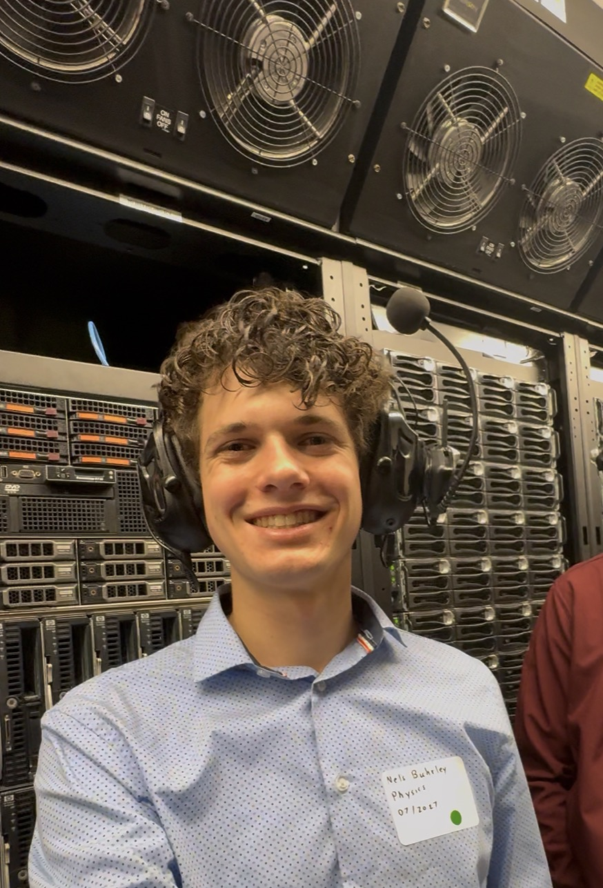

# Computational Physics Portfolio

> [!TIP]
> Every highlighted link in this page is clickable.
> For fast navagation use [Table of Contents](#table-of-contents)


**Nels Buhrley**
*Physics Student — Brigham Young University–Idaho*

---

## Table of Contents

- [About](#about)
- [**Academic Projects**](#academic-projects)
- [Personal Projects](#personal-projects)
- [**Selected Results**](#selected-results)
- [The Fulton Supercomputer at BYU](#the-fulton-supercomputer-at-byu)
- [Quick Start](#quick-start)
  - [Build Toolchain](#build-toolchain)
  - [Prerequisites](#prerequisites)
- [Repository Structure](#repository-structure)

---

## About

I created this repository as a collection of **thirteen numerical simulation and computational mathematics projects** developed during my physics coursework and independent study. The work spans classical mechanics, electrostatics, statistical mechanics, quantum mechanics and number theory — all implemented in **C++17** with **Python 3** visualization pipelines.

### Core Competencies

| Area | Details |
|---|---|
| **Languages** | C++17, Python 3 |
| **Numerical Methods** | Runge-Kutta (RK4), Euler-Cromer, Störmer-Verlet, Monte Carlo (Metropolis), Finite Differences, Successive Over-Relaxation, FFT spectral analysis |
| **Parallelism** | OpenMP multi-threadin, manual thread allocation, and parrellel logic implimentation in tightly coupled simulations |
| **High-Performance Computing** | BYU Supercomputer — SLURM batch scheduling with up to 128 CPU cores for intensive simulations (Projects 4, 6, 7) |
| **I/O & Visualization** | CSV, NPZ (via cnpy/zlib), Matplotlib (3D surfaces, contour maps, animations, phase-space portraits), Plotly (interactive HTML plots) |
| **Build Systems** | GNU Make with multi-target builds (debug, release, profile-guided optimization) |

---

## Academic Projects

| # | Project | Physical System | Numerical Method | OpenMP | HPC |
|---|---|---|---|---|---|
| 1 | [Realistic Projectile Motion](Project%201%3A%20realistic%20projectile%20motion/) | 3D ballistics with drag, spin (Magnus), wind | 4th-order Runge-Kutta | — | — |
| 2 | [Driven Damped Oscillations](Project%202%3A%20driven%20damped%20oscillations/) | Nonlinear pendulum → periodic & chaotic regimes | RK4 + Euler-Cromer; Poincaré sections | — | — |
| 3 | [Celestial Dynamics](Project%203%3A%20Celestial%20Dynamics/) | N-body gravitational orbits (full Solar System) | RK4, Euler-Cromer, Störmer-Verlet | — | — |
| 4 | [Overrelaxation](Project%204%3A%20Overrelaxation/) | 3D Laplace's equation (electrostatics) | Red-Black SOR with optimal $\omega$ | ✓  | ✓ |
| 5 | [Oscillations on a String](Project%205%3A%20Occilations%20on%20a%20string/) | Damped stiff wave equation + spectral analysis | Finite differences (2nd + 4th order) + KissFFT | ✓ parallel spatial | — |
| 6 | [Diffusion](Project%206%3A%20Diffusion/) | 3D Brownian random-walk ensemble | Monte Carlo with reflective BCs | ✓ parallel particles | ✓ |
| 7 | [The Ising Model](Project%207%3A%20The%20Ising%20Model/) | 3D ferromagnetic phase transition | Metropolis MCMC, checkerboard sweep | ✓ multifactor parallel | ✓ 128 CPUs |
| 8 | [Molecular Dynamics](Project%208%3A%20Molicular%20Dynamics/) | 2D Lennard-Jones fluid (400 particles) | Velocity Verlet, O(N²) pair forces | ✓ thread-local accumulators | ✓ 8 CPUs |
| 9 | [Quantum Mechanics](Project%209%3A%20Quantum%20Mechanics/) | 1D Schrödinger equation, polynomial potentials (degrees 2–6) | Numerov 4th-order integration, nodal bracketing, bisection energy refinement | — | — |

### Progression

The projects follow a deliberate arc of increasing computational sophistication:

- **Projects 1–3** build fluency with ODE integration (RK4, symplectic methods) and interactive simulations
- **Project 4** introduces PDE solving, iterative methods, and OpenMP parallelism
- **Projects 5–6** combine PDE/stochastic methods with spectral analysis and 3D particle tracking
- **Project 7** synthesizes everything: statistical physics, Monte Carlo methods, precomputed lookup tables, multi-dimensional parameter sweeps, and full HPC deployment
- **Project 8** tackles the hardest parallelization challenge — an $O(N^2)$ N-body problem where Newton's third law optimizations create race conditions, resolved via thread-local accumulators and guided scheduling
- **Project 9** applies boundary value problem solvers to quantum mechanics: energy quantization through nodal counting, high-order Numerov schemes, and robust bisection convergence

---

## Personal Projects

| # | Project | Domain | Key Challenge | Parallelism |
|---|---|---|---|---|
| 1 | [Collatz Conjecture (3n+1)](Personal%20Project%201%3A%203n%2B1/) | Number theory | Exhaustive sequence analysis for $n \leq 10^6$; recursive max-value chaining | — |
| 2 | [Euler's Idoneal Numbers](Personal%20Project%202%3A%20Idelic%20Numbers/) | Number theory | Sieve over triple loop $a < b < c$ up to $5 \times 10^7$; thread-safe monotonic writes | ✓ OpenMP `dynamic` |
| 3 | [Monty Hall Problem](Personal%20Project%203%3A%20Monty%20Hall%20Simulation%20%28Goat%20and%20Car%20Game%20Show%29/) | Probability & Statistics | Monte Carlo simulation to empirically verify counterintuitive theoretical predictions | — |

---

## Selected Results

### Project 7: The Ising Model

<div style="width: 100%; aspect-ratio: 16 / 9; max-height: 80vh; overflow: hidden; border: 1px solid #ddd; border-radius: 8px;">
    <iframe
        src="https://nelsbuhrley.github.io/assets/html-assets/magnetization_3d_interactive_embedded.html"
        width="100%"
        height="100%"
        style="border: none; display: block;">
    </iframe>
</div>

<a href="https://nelsbuhrley.github.io/assets/html-assets/magnetization_3d_interactive.html" target="_blank">View Simulation Fullscreen ↗️</a>

<p align="center">
  
  
</p>

Magnetization surface and contour map of the 3D Ising model, revealing the ferromagnetic phase transition at $T_c \approx 4.51\,J/k_B$. Monte Carlo Metropolis algorithm with checkerboard sweep optimization across 2D temperature × magnetic field parameter space.

[→ View detailed results](Project%207%3A%20The%20Ising%20Model/#results)

---

### Project 8: Molecular Dynamics

<p align="center">
  <video width="70%" controls autoplay muted loop style="border-radius: 8px; box-shadow: 0 4px 8px rgba(0,0,0,0.1);">
    <source src="https://nelsbuhrley.github.io/assets/videos/md_animation2.mp4" type="video/mp4">
    Your browser does not support the video tag.
  </video>
  <br>
  <em>Heating/cooling cycle simulation of 400 particles under Lennard-Jones potential. Particle trajectories show transition from ordered grid to gas-like disorder during heating, then re-ordering during cooling. A shock wave propagates down from the top and reflects back up after the particles expand to the container boundary.</em>
</p>

[→ View detailed results](Project%208%3A%20Molicular%20Dynamics/#results)

---

### Project 4: Overrelaxation (Electrostatics)

<div style="width: 100%; aspect-ratio: 16 / 9; max-height: 80vh; overflow: hidden; border: 1px solid #ddd; border-radius: 8px;">
    <iframe
        src="https://nelsbuhrley.github.io/assets/html-assets/potential_3d_interactive_dynamic_embedded.html"
        width="100%"
        height="100%"
        style="border: none; display: block;">
    </iframe>
</div>

<a href="https://nelsbuhrley.github.io/assets/html-assets/potential_3d_interactive_dynamic.html" target="_blank">View Simulation Fullscreen ↗️</a>

Interactive 3D visualization of electrostatic potential field solved via Successive Over-Relaxation (SOR) with optimal relaxation parameter $\omega \approx 1.84$. Navigate through z-axis slices to explore the full 3D solution space ($N=1000^3$ grid points).

[→ View detailed results](Project%204%3A%20Overrelaxation/#results)

---

### Project 3: Celestial Dynamics

<p align="center">
  
</p>

N-body orbital dynamics of the Solar System computed with 4th-order Runge-Kutta integration. Simulation tracks all major planets over multi-year timescales, demonstrating long-term orbital stability and resonance effects.

[→ View detailed results](Project%203%3A%20Celestial%20Dynamics/#results)

---

### Project 9: Quantum Mechanics

<div style="width: 100%; aspect-ratio: 16 / 9; max-height: 80vh; overflow: hidden; border: 1px solid #ddd; border-radius: 8px;">
    <iframe
        src="https://nelsbuhrley.github.io/assets/html-assets/eigenstates_tabs_simple.html"
        width="100%"
        height="200%"
        style="border: none; display: block;">
    </iframe>
</div>

<a href="https://nelsbuhrley.github.io/assets/html-assets/eigenstates_tabs_detailed.html" target="_blank">View Eigenstates Fullscreen ↗️</a>

Interactive visualization of bound states for polynomial potential wells (degrees 2–6). Each tab displays eigenstates with 3D wavefunction plots overlaid with the potential well shape. Eigenstates computed via Numerov 4th-order integration, energy quantization by nodal counting, and bisection refinement to machine precision ($\Delta E < 10^{-15}$).

[→ View detailed results](Project%209%3A%20Quantum%20Mechanics/#results)

---

### Project 5: Oscillations on a String

<p align="center">
  
</p>

Mean power spectrum of transverse string oscillations showing discrete normal-mode peaks. FFT spectral analysis reveals harmonic structure and damping characteristics from finite-difference wave equation solver.

[→ View detailed results](Project%205%3A%20Occilations%20on%20a%20string/#results)

---

### Project 6: Diffusion

<p align="center">
  
</p>

Mean squared displacement from 3D random-walk Monte Carlo simulation, confirming Einstein's diffusion law $\langle r^2 \rangle = 6Dt$. Ensemble of $10^6$ particle trajectories with reflective boundary conditions.

[→ View detailed results](Project%206%3A%20Diffusion/#results)

---

### The Fulton Supercomputer at BYU

<table>
<tr>
<td width="60%" valign="top">

The <strong>Fulton Supercomputer</strong> (managed by the BYU Office of Research Computing) is a HPC cluster providing the processing backbone for my numerical modeling and simulation work. It manages over <strong>35,000 CPU cores</strong> and <strong>360+ GPUs</strong>, supported by a <strong>6 PB</strong> parallel filesystem.

<p><strong>Architecture & Resources (2026 Specs):</strong></p>

<table>
<tr>
<td><strong>Compute Nodes</strong></td>
<td><strong>AMD EPYC 7763</strong> (128 cores/node), <strong>Intel Xeon Platinum 8568Y+</strong> (96 cores/node)</td>
</tr>
<tr>
<td><strong>High-Memory</strong></td>
<td>Up to <strong>2 TB of DDR5 RAM</strong> for memory-intensive simulations</td>
</tr>
<tr>
<td><strong>GPU Acceleration</strong></td>
<td><strong>NVIDIA H200 (141GB)</strong>, <strong>L40S (48GB)</strong>, <strong>A100 (80GB)</strong></td>
</tr>
<tr>
<td><strong>Interconnect</strong></td>
<td><strong>100 Gb/s InfiniBand</strong> and RoCE v2 low-latency networking</td>
</tr>
<tr>
<td><strong>Storage</strong></td>
<td><strong>6 PB</strong> parallel filesystem via <code>/fslhome</code> and local <strong>NVMe scratch</strong></td>
</tr>
</table>

</td>
<td width="40%" valign="top">



<p><em>Me at the BYU HPC cluster, February 2026</em></p>

</td>
</tr>
</table>

---

## Workflow & Scheduling

### Job Management
I utilize **SLURM (Simple Linux Utility for Resource Management)** to orchestrate simulations. This involves writing batch scripts that request specific hardware constraints to optimize performance, such as:
* `--constraint=avx512` for vector instructions.
* `--qos=standby` for acess to unused priviate hardware.

### Environment & Compilation
Development is performed on **RHEL 9.4** login nodes using *Remote - SSH* and the linux terminal to manage my development and computational resources. I manage software dependencies via the `module load` system, typically involving:
* **GCC/G++** for core simulation logic.
* **OpenMPI** for distributed memory parallelism.
* **Python 3/ffmpeg** for visiulation

---

## Physics Implementation
On this cluster, I implement numerical solvers for complex potentials where the computation scales as $O(N^{2+})$. For a system of $N$ particles, the potential $V$ is calculated as:

$$V = \sum_{i < j} \frac{q_i q_j}{4\pi\epsilon_0 |\mathbf{r}_i - \mathbf{r}_j|}$$

By utilizing **OpenMP** for multi-threading and **MPI** for node-to-node communication, I can distribute these calculations, significantly reducing the wall-time required for high-resolution datasets.

```cpp
// Example: Basic OpenMP Parallelization for Force Calculation
#pragma omp parallel for reduction(+:total_energy)
for (int i = 0; i < N; ++i) {
    for (int j = i + 1; j < N; ++j) {
        total_energy += calculate_interaction(particles[i], particles[j]);
    }
}
```

**Simulation Deployment (This Portfolio):**

| Project | Configuration | CPUs | Wall Time | Use Case |
|---|---|---|---|---|
| Project 4 (SOR) | CPU-only, `#threads=16` | 16 | 30–45 min | Strong-scaling study of iterative PDE solver |
| Project 6 (Diffusion) | CPU-only, `#threads=32` | 32 | 2-3 min | Parallelizing independent particle trajectories |
| Project 7 (Ising) | CPU-only, `#threads=128` | 128 | 10–45 min | Large parameter-space sweep with checkerboard MCMC |
| Project 8 (Molecular Dynamics) | CPU-only, `#threads=8` | 8 | 10 min–2 hrs | Thread-local force accumulation (race condition mitigation) |

**Key Advantages for This Work:**
- **Scalability Testing:** Weak and strong scaling studies for OpenMP efficiency (Projects 4, 7, 8)
- **Parameter Sweeps:** Multi-dimensional search spaces (Project 7: 2D temperature × field grid)
- **Long-Running Simulations:** Statistical ensembles (Project 6: millions of particle trajectories)
- **Reproducibility:** Identical hardware across multiple runs for benchmarking and verification

---

## Quick Start

Every project follows the same workflow:

```bash
# 1. Navigate to a project
cd "Project 7: The Ising Model"

# 2. Build
make release

# 3. Run
./bin/main

# 4. Visualize
python3 plotting.py
```

### Build Toolchain

| Tool | Version | Notes |
|---|---|---|
| **Compiler** | `clang++` / `g++` (C++17) | Platform-detecting Makefiles |
| **OpenMP** | Homebrew `libomp` (macOS) / native (Linux) | Projects 4–7 |
| **zlib** | System | For `.npz` output via `cnpy` |
| **Python** | 3.x | `numpy`, `matplotlib`, `pandas` |
| **SLURM** | BYU Supercomputer | Batch scheduling for HPC runs |

### Prerequisites

```bash
# macOS
brew install libomp
pip3 install numpy matplotlib pandas

# Linux (e.g., BYU Supercomputer)
module load gcc python   # or equivalent
pip3 install numpy matplotlib pandas
```

---

## Repository Structure

```
CPP_Workspace/
├── README.md                          # ← This file (Portfolio Hub)
│
├── Project 1: realistic projectile motion/    # RK4 ballistics with drag & Magnus
├── Project 2: driven damped oscillations/     # Nonlinear pendulum & chaos
├── Project 3: Celestial Dynamics/             # N-body gravitational simulation
├── Project 4: Overrelaxation/                 # 3D Laplace solver (SOR + OpenMP)
├── Project 5: Occilations on a string/        # Wave equation FD + FFT spectral
├── Project 6: Diffusion/                      # 3D random-walk Monte Carlo
├── Project 7: The Ising Model/                # 3D Metropolis MCMC (HPC)
│
├── Personal Project 1: 3n+1/                 # Collatz conjecture exploration
├── Personal Project 2: Idelic Numbers/        # Euler's idoneal number sieve
│
├── include/                                   # Shared libraries
│   ├── cnpy.h                                 # NPZ I/O library
│   └── vector3d.h                             # 3D vector utilities
├── src/
│   └── cnpy.cpp                               # cnpy implementation
│
├── reference/                                 # Study notes & cheatsheets
│   ├── CPP_BASICS.md
│   ├── FUNCTIONS_REFERENCE.md
│   ├── NUMERICAL_PHYSICS.md
│   ├── OPTIMIZATION_TIPS.md
│   └── SLURM_FORMATING.md
│
└── Template Makefile                          # Reusable build template
```

---

*Nels Buhrley — BYU-Idaho Physics, 2025–2026*
